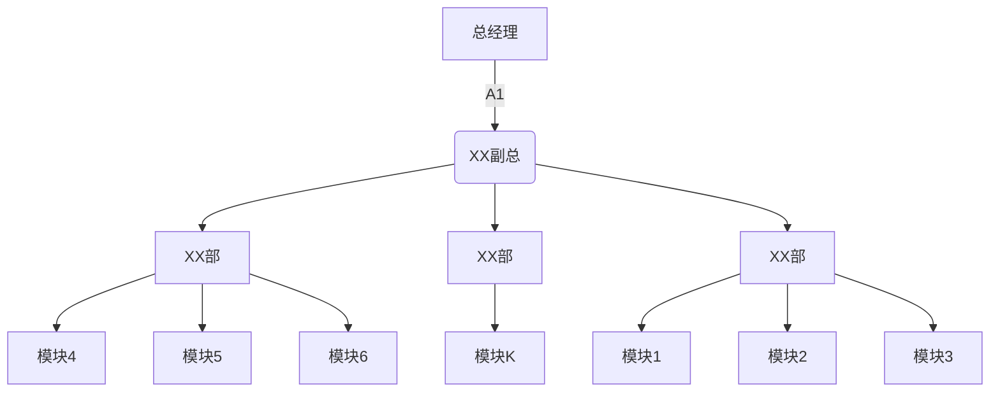

行为式验证码
==============

# 整体概述

*   关键字：交互验证码、图形验证码、互动验证码、行为式验证码
*   相关算法：相似度算法、
*   代码框架
    *   java后台：api及交互方式代码分类，高度扩展，
    *   前台交互：通过js闭包方式对框架进行处理，核心代码和交互插件分类、通过webpack方法打包
    *   [Demo 地址](http://123.207.96.135/captcha/ "Demo 地址")
*   TODO

        [√] 拼图验证
        
        [√] 顺序点击验证
        
        [ ] 语义验证
        
        [ ] 图片旋转验证

# 前端概述

## 设计原则

*   基础代码和扩展代码分类
*   不同行为通过插件方式嵌入
*   可通过打包工具进行代码编译及发布，合理的管理代码

## 架构设计

### 概述
>   通过webpack工具进行打包、压缩、混淆。核心代码与可扩展行为交互代码分开关联。最后打包成最后文件。

### 文件说明

>   /core.js                核心基础文件

>   /plugin/jigsaw.js       拼图交互文件

>   /plugin/point-click.js  点击方式交互文件

### 方法调用

```
    var conf = {'content':'can'}; //设置参数

    var callback = function(data){  //创建回调函数 进行验证
        $.ajax({
            url : "/verifiCode",
            type : "POST",
            dataType: 'text',
            contentType:'application/json;charset=UTF-8',
            data:data,
            success : function(result) {
                if(result=="false") {
                    init();
                }else{
                    alert("success");
                    init();
                }
            }
        });
    }

    var init = function(){
        $.ajax({
            url : "/captcha?handler="+$('input:radio:checked').val(),
            success : function(result) {
                jsonljd.captcha(conf).build(result,callback);   //调用验证创建函数，并渲染数据，传入回调方法。
            }
        });
    }

    $(function(){
        init();
    });

    $('input:radio').change(function(){
        init();
    });
```

### 扩展考虑

>   交互方式通过插件的方式进行，通过调用核心类中的plugin方法把，交互方式加入到框架当中。

```
    var 插件对象 = {
        name:"插件名称",
        build:function(
        
        /*
        配置对细节
        conf.unit //核对代码中的方法对象
        conf.captchaData.params  //交互的验证数据对象参数
        conf.bgWidth    验证图的背景宽
        conf.bgHight    验证图的背景高
        */
        conf ,
        
         /*交互结束后的回调函数*/
        callbak){
        }
    };
```

>   jsonljd.plugin(插件对象); //调用插件方法，把插件对象加入框架中。

>   实例：
```
var pulgin_demo = {
    name:'demo',
    build:function(conf,callbak){
        var obj = {};
        callbak(obj);
    }
}
    jsonljd.plugin(pulgin_demo);
```

## 打包方式

```
#   npm run build  //构建
```

------------
# 后端概述

## 设计原则

*   结构明朗
*   可扩展、易维护

## 架构设计

### 整体说明
*   通过java底层进行架构封装
*   高度抽象接口及实现方式
*   调用简单


### 架构图


### 接口说明



### 主要方法

### 核心方法

### 扩展设计

### 调用方法

### 特别说明


